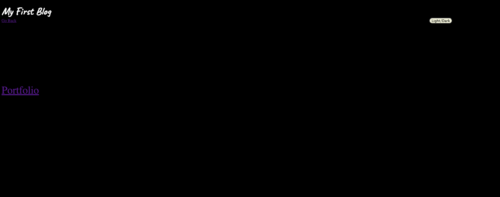

Description:
First page form for blog post with username, article title and content inputs. Second page contains area for blogs from data entered in first page (was not able to transfer data from first page to the second). Second page has a back button that leads back to the first page, a light dark mode that has a simple change in background color and title color, and a link to a portfolio page. 

Creations Made:
Used flex box and container element to create 2 areas within the first page that display what the page is about "My first blog" and a form for submitting blog information. Used inputs elemenst for form inputs and applied CSS styling to all elements on the page. Used localstorage and jsonparse to have data inputted on first page to be stored within local storage.
Used adeventlistener for light/dark mode for second page. For portfolio and back buttons, an href link was applied for directing user to those pages. 

Sources: 

background image: (https://www.elegantthemes.com/blog/wp-content/uploads/2013/09/bg-9-full.jpg)
dark mode: https://www.youtube.com/watch?v=C-ayUVbeShs
local storage: https://www.youtube.com/watch?app=desktop&v=9n3qAeaBMGU
local storage: https://www.youtube.com/watch?v=hG0YDpePCjI

Activity 26 from O4-Web_APIs (local storage)
Activity 5 from 05-Third-Party-APIs (container and form)

